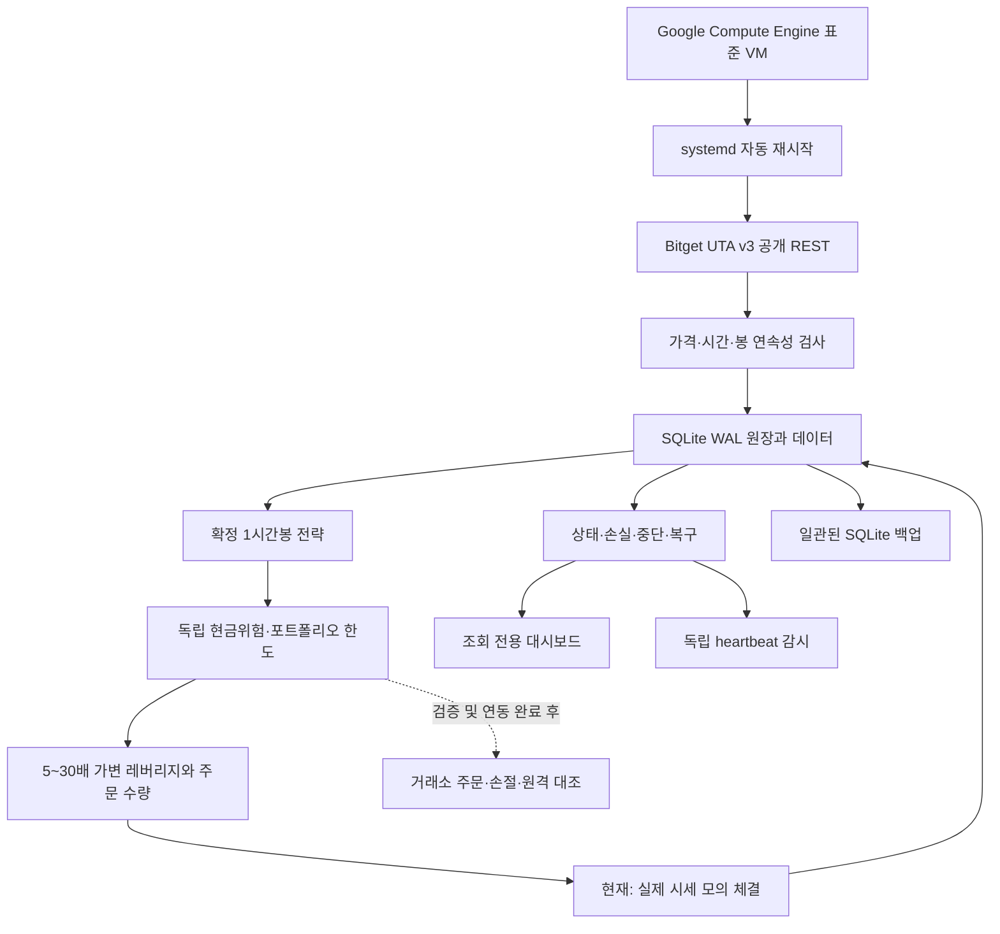

# Bitget Auto Coin Trading — 새 프로젝트 설계도

작성: 2026-09-22 · 구현 패키지: `src/bitget_bot` · 상태: 검증 중

## 1. 이번 요청과 참조 자료의 관계

사용자의 최신 요청이 우선한다. 두 기존 폴더와 루트의 `astra 지시문.md`, `CODEX_ASTRA_CRYPTO_FUTURES_MASTER_BUILD_SPEC.md`는 검토 자료이며 원본은 보존한다. 예전 문서의 단계별 정지·승인 요청과 크레딧 절약 절차는 새 프로젝트에 적용하지 않는다. 모든 새 결과물은 이 폴더에 작성한다.

목표는 비용 차감 후 장기 기대수익과 생존성이다. 최고 수익이라는 보장은 할 수 없으며, 검증하지 않은 전략을 검증 완료로 부르지 않는다. 지금까지 기존 연구 결과는 매우 짧은 표본이고 수익성을 입증하지 못했다.

## 2. 구조

단일 VM·단일 거래 작성자·SQLite WAL을 사용한다. 현재 종목 수와 1시간 전략에는 여러 프로세스와 PostgreSQL의 운영 부담보다 트랜잭션 일관성과 복구를 우선한다. 다중 작성자나 대규모 데이터 연구로 확대할 때 PostgreSQL로 이전한다. 고가용성 다중 봇 동시 주문은 구현하지 않는다.

## 3. 채택·변경·제거

| 항목 | 결정 | 이유 및 검증 |
|---|---|---|
| 완성 봉·인과적 신호 | 유지 | 미래 데이터 삽입에도 기존 신호가 변하지 않는 테스트 |
| 추세·돌파 가설 | 유지/단순화 | 1시간 24봉 돌파+EMA100을 새 연구 기준선으로 정의. 원래 V1 구현이라고 부르지 않음 |
| 5분 체결 강제 | 변경 | 1시간 확정 신호 후 현재 실행 가능 가격. 비용과 노이즈 비교 연구 대상으로 남김 |
| OI·Funding Z·Premium Z | 연구 보류 | 과거 동시점 데이터와 추가 기여 증거 없이 알파 필터로 강제하지 않음 |
| spread·basis·극단 funding | 유지 | 현재 실행 품질/위험 필터로 사용 |
| 3배 고정 상한 | 사용자 요청으로 변경 | 범위 5~30, 손실 예산은 별도 고정 |
| 손실 물타기·마틴게일 | 제외 | 손실 복구를 위해 위험량을 늘리지 않음 |
| 과거 구현 직접 복제 | 제외 | 서명·실행 진입점·복구/손절 결함 확인 |
| 실거래 자동 승격 | 제외 | 수익성·체결·복구 검증 증거가 없으면 활성화 불가 |
| 단계마다 사람에게 질문 | 제거 | 이번 요청으로 구현·검증·배포 진행 권한이 있음 |

## 4. 전략 명세 v0.1-research

초기 종목 BTCUSDT/ETHUSDT/SOLUSDT/XRPUSDT. 공개 선물 데이터로 UTC 정렬된 완성 1시간봉만 계산한다. 현재 종목을 과거 상장 전체의 대표 표본으로 주장하지 않는다.

- LONG: 직전 24개 봉의 고가 돌파 + EMA100 위 + 6봉 EMA 기울기 양수.
- SHORT: 직전 24개 봉의 저가 이탈 + EMA100 아래 + 6봉 EMA 기울기 음수.
- 신호 봉은 채널 계산에서 제외하고 ATR14를 계산한다.
- 초기 손절 2 ATR. 12개 완성 봉 채널로 유리한 방향만 추적한다.
- 최대 보유 48시간. 청산 후 2봉 대기. 매 봉 신호는 한 번만 처리한다.
- 신호 시가가 아닌 다음 실제 실행 가능 호가로 체결을 모형화한다.
- 연구 후보: 돌파24, 돌파48, 시계열 모멘텀48. 결과를 보고 운용 설정을 자동 변경하지 않는다.

이 기준선이 최적 전략이라는 주장은 하지 않는다. 복잡한 필터를 추가하려면 시간순 외표본·비용 스트레스·인접 파라미터 시험에서 순기여를 입증해야 한다.

## 5. 위험·레버리지

초기 현금위험은 거래당 자산의 0.10%. 모든 코인을 하나의 상관 군집으로 보고 총 잔여 위험 0.70%, 전체 증거금 30%, 총 명목노출 2배를 상한으로 둔다.

`수량 = 현금위험 예산 / (손절 가격거리 + 왕복 수수료 + 보수적 슬리피지)`

선물 계약 정밀도로 아래쪽 반올림한다. 최소 주문을 맞추려고 위험 예산을 올리지 않는다. 허용 수량 미달은 거래하지 않는다.

5~30배 레버리지는 변동성과 손절 거리·유지증거금 가정·청산 여유를 고려해 선택한다. 증거금 레버리지와 계좌 총노출은 다르다. 30배 선택이 계좌 자산 30배 주문을 뜻하지 않는다. 안전하게 가능한 레버리지가 5배 미만이면 진입을 포기한다. 실제 청산가는 거래소 위험 tier·수수료·margin 상태에 의존하므로 이 계산은 보수적인 모형이며 실거래 청산 보증이 아니다.

- 낙폭 5%부터 신규 위험 절반, 8%에서 지속 HALT.
- 최근 24시간 자산 손실 1.5%면 12시간 신규 진입 정지, 2.5%면 HALT.
- HALT는 재시작해도 유지한다. 기존 모의 포지션 관리는 계속한다.
- 시세 오래됨·시계 오차·데이터 누락·장부 오류는 신규 진입 금지.
- Kill switch 파일과 CLI halt를 제공한다.

## 6. 데이터·체결·회계

현재 구현은 실제 시세 PAPER이며 계정 자금과 독립된 가상 10,000 USDT로 시작한다. 주문이 거래소로 전송되지 않는다. 기본 수수료 편도 6bp·슬리피지 편도 4bp는 검증용 가정이고 계정 실수수료라고 주장하지 않는다.

장부·신호 처리·수수료·포지션·funding 상태는 한 트랜잭션으로 저장한다. 유일 신호 ID와 단일 작성자 OS lock으로 중복 처리를 막는다. 재시작 시 설정 fingerprint와 기존 장부 모드를 확인한다.

진입 이후의 1분봉을 시간순 재생하고 보수적인 gap stop 체결을 적용한다. 이미 지난 봉에 trailing을 소급 적용하지 않는다. 첫 부분 봉 및 봉 내부 경로는 완전히 관측할 수 없으며 모의 체결의 한계로 기록한다. 실제 funding 정산 rate를 받아 적용하되 정산 순간 체결가능 가격은 모형값이다. 실제 거래소 수수료·체결·청산 재현이 아니다.

## 7. 거래소 실거래 경로의 완료 조건

UTA/Classic 계정 호환 확인, API read/trade 권한·고정 IP 확인, 정확한 전송 바이트 서명, clientOid durable intent, 모호한 POST 응답 조회 복구, 부분 체결 즉시 보호, 원격 stop 수량·방향·트리거 검증, 보호 실패 reduce-only 청산과 그 청산의 durable intent, 재시작 시 미확정 주문→체결→포지션 순 복구, 주기적 원격 대조, 실현손익/수수료/funding 원장을 모두 검증한다.

미완료 기능을 환경변수 하나로 우회하지 않는다. 기존 실제 API 키를 Demo 키로 간주하지 않는다. 출금/전송은 어떤 경로에도 없다. 인증 조회는 비밀값·잔액·계정 ID를 출력하지 않는다.

## 8. 연구와 승격

시간순 warmup/train/validation과 별도 보류 구간을 나눈다. 미래 봉, 같은 봉 종가 즉시 체결, 미실현손실 제외 MDD를 금지한다. 신호와 체결 모형은 명시한다. funding 원천 부족 결과는 exploratory로 표시한다.

공유 자본 포트폴리오 검증, 최소 400건/종목별 60건, 비용 후 PF 1.20 이상, 6개 이상 walk-forward, 12개월 수준 별도 OOS, 인접 파라미터 70% 이상 양의 기대값, 비용/지연 스트레스, 5,000회 이상 block bootstrap은 향후 실거래 연구 게이트다. 숫자는 합의 가능한 정책이지 수익의 보증이 아니다. 8주/80건 이상 paper/demo와 장애복구 증거 없이는 연구 완료라고 표시하지 않는다. 현재 모두 미충족이다.

## 9. 클라우드 운영

Google Compute Engine Ubuntu 표준 VM, 고정 외부 IP, 자동 재시작/live migration, systemd 서비스와 독립 heartbeat 감시. 공개 DB/관리 포트 없음. 조회 화면은 loopback 전용으로 SSH tunnel을 사용한다. 코드만 allowlist 배포하고 .env/원본 폴더/장부를 bundle에 포함하지 않는다. 실거래 단계에서만 Secret Manager와 최소 권한 서비스 계정을 적용한다.

배포 완료는 VM 이름/zone/IP, 서비스 active, 공개 API 수신, 지속 heartbeat, 재시작 후 동일 원장 복구까지 직접 확인한 뒤 기록한다. 외부 알림은 채널이 연결되기 전까지 제공 완료라고 부르지 않는다.

## 10. 중단 후 이어가기

사용자가 `이어서 작업해`라고 하면 루트 PROJECT_STATE.md → 이 설계도 → 최근 artifacts 결과를 읽고 미완료 항목부터 계속한다. 코드/테스트/배포 상태와 정확한 다음 명령을 기록한다. 오래된 참조 프로젝트를 다시 시작하지 않는다.

## 공식 근거

- [Bitget UTA 주문 지침](https://www.bitget.com/docs/uta/best-practices-guide): 접수 성공은 체결 확정이 아니며 clientOid 조회가 필요.
- [Bitget Demo API](https://www.bitget.com/docs/uta/demo-trading/rest-api): 별도 Demo API 키와 paptrading=1.
- [Bitget UTA 시작 가이드](https://www.bitget.com/docs/uta/quick-start): 서명 및 권한.
- [Google Compute startup scripts](https://docs.cloud.google.com/compute/docs/instances/startup-scripts/linux).

세부 API 검증 기록은 docs/API_CONTRACT.md, 클라우드는 docs/CLOUD_RUNBOOK.md를 참조한다.
